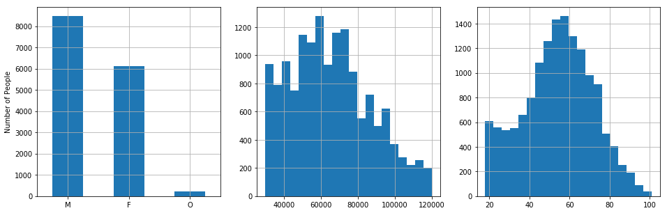
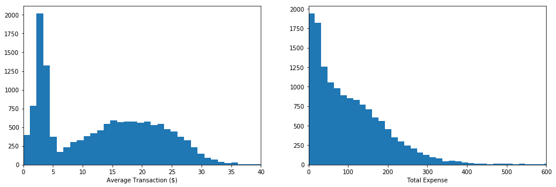
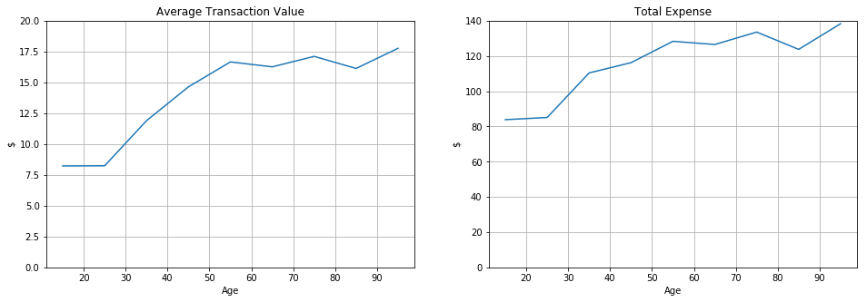
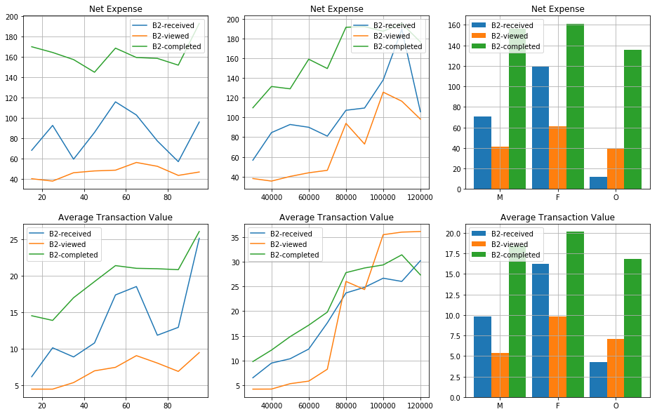
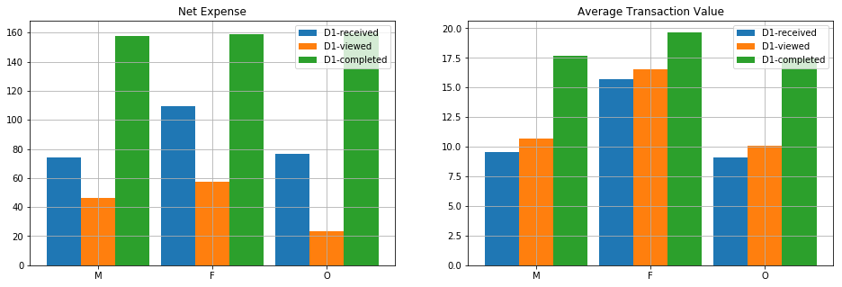
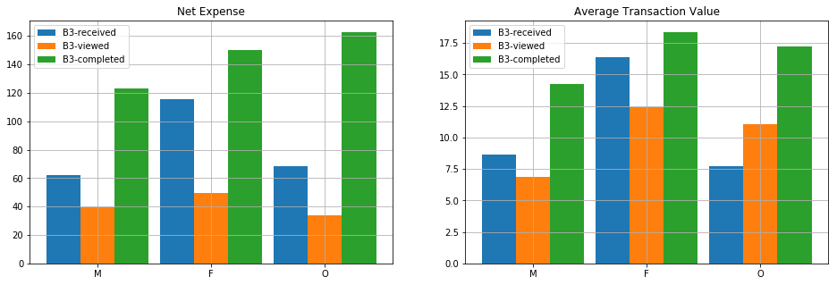

# Starbucks Capstone Challenge

## Introduction

Starbucks has provided a dataset that emulates the behavior of
customers using the Starbucks rewards mobile app. The Starbucks app
provides a way to advertise and share offers with the
customers. Customers can also use it to pay at the stores. Starbucks
sends different types of advertisement and offers once every few days to their
customers. A customer might get one of the following:

- Informational offer (i.e., mere advertisement)
- Discount offer
- Buy one get one free (BOGO) offer

Discount and BOGO offers have a challenge, that is, the customer must
make a minimum purchase before it can redeem the offer. Additionally,
each offer has an expiration date. In the case of the informational
offers, the expiration date is when the customer stop feeling the
influence of the advertisement.

The data provided includes the demographics of each customer, the app
activity of customers for a period of 30 days. It includes the
timestamps of when a costumer received, viewed and completed an offer,
when a purchase was done, and the amount of money spent.


## Problem Statement

The goal of sending advertisement and offers to customers is to
increase the customer purchases. However, it would be naive to send
all offers to all customers at the same time. The goal of the project
is to take advantage of the transactions and demographics data to
determine the offers that should be targeted to different groups of
customers.

## Datasets

The following data files have been provided and included in the project's [repo](https://github.com/aproano2/starbucks)

- `portfolio.json` contains the details of each offer: duration, reward, type, etc
- `profile.json` contains demographic information of customer
- `transcript.json` contains all customers activity: transactions, offers received, offers viewed, and offers completed.

The datasets were cleaned and merged in a way that each row includes
customers activity, customers demographics and offers metadata.


## Data Analysis

### Population

From the datasets, we first note that the simulated data was obtained
for a period of 29.75 days, with 306,534 events. Each event represents
a transaction, an offer received, an offer viewed, or an offer
completed.

<div style="text-align:center">

</div>

The figure shows the distribution of the population based on gender,
income and age. We note that around 8,500 customers are male, 6,100
are female and around 200 belong to other gender. In the case of the
income, we observe that curve roughly approaches a normal curve with a
mean around 65,000 and a standard deviation of 21,000. Finally, the
age also seems to approach a normal distribution. It is truncated on
the left side of the curve due to the fact that a customer must be 18
years or older to be part of the Starbucks program. The mean of the
age is 54 years and the standard deviation is 17.

### Expense

<div style="text-align:center">

</div>

Now, we observe that the average expense of a single transaction
follows a bimodal distribution. The first lobe is centered around $2.5
and the second one around $18. In the case of the distribution of the
total expense done by a customer the values seems to decrease
exponentially.

<div style="text-align:center">

</div>

When separating the data based on gender, we note that the women make
average purchases of $17.5, others of $15 and men of $12. However, we
also note that the total amount of money spent by men and women is
similar (~85,000) while others spend a fraction of that. This is
distributions are directly affected by the number of members of each
gender group.

<div style="text-align:center">

</div>

In the case of the average transaction and the total expense, we see
that the values increase as the income of the customer increases,
which is expected. People that make less than $30,000 have an average
transaction of $6 while people making more than $90,000 have
transactions of more than $25. In the case of the total expense, the
values go from $60 to $180 in the same range of income.

<div style="text-align:center">

</div>

As in the case of income, the spending behavior is similar with
age. As the value of age increases so do the average transaction and
the total expense values. The average transaction value goes from a value of
$8 for people under 20 to a value of $17 for people above
55. Similarly, the total expense goes from $80 in a month to almost
$140.

### Offers

<div style="text-align:center">

</div>

The figure above shows the distribution of offers received by
customers. We note that each 30,000 discount and bogo offers have been
received, and 15,000 informational ones. The latter offer is half of
the others since there are only two informational offer and there are
four discount and four bogo. Moreover, we note that each offer has
been received by around 7,600 customers. This detail is important
since the simulated data does not have any bias towards an specific
offer, each customer has the same changes of receiving any offer.

## Offer Recommendation

Based on the data we have observed, we noticed that different customer
groups have different spending habits, that might be influenced by the
fact that they received an offer or not. For instance, the correlation
coefficient of `0.52` suggest that there is a moderate correlation
between the net expense (i.e., `total expense - reward received`) and
the whether a customer completed an offer or not. Similarly, the
correlation with the completion of bogo and discount offers is `0.39`
and `0.40`, respectively. Finally, we observe a moderate correlation
of 0.38 with the income of the customers.

These correlation indicate that offers should be targeted to customers
based on their income or their transaction behavior. To take this into
account, a knowledge-based recommendation system was implemented.

### Simple System

Initially, we consider a simple system that recommends an
offer that has been completed by a group of customers with the highest
median of the net expense value. This system assumes a dependency
between offer completion and net expense, and aims at maximizing the
net expense.

In order to use significant samples, we impose the following conditions:

1. Customers with positive net expense.
2. Customers with at least 5 transactions completed.
3. Only use customers that viewed and completed the offer.

The first condition is due to the fact that some customers received
more rewards than the amount of money they spent. This is possible due
to the fact that (a) a customer might have multiple offers active at
the same time, and (b) a transaction might help multiple offers to
reach their goal.

The second condition is necessary so we consider customers engaged
with the offer/reward system. Finally, the third condition also
targets at considering customer engaged with the system. There are a
few customers that completed offers without knowing that they received
an offer.

As an example of this simple recommendation system, we call the
program and it provides the following list of offers sorted in the
order of recommendation.

```
> offers = get_most_popular_offers(customers, n_top=10, q=0.9)
> print(offers[0])

['B1', 'D1', 'B2', 'D3', 'D4', 'B3', 'B4', 'D2', 'I1', 'I2']

> print(offers[1])

{'B1': 285.569, 'D1': 279.355, 'B2': 276.955, 'D3':
273.03100000000006, 'D4': 271.94599999999997, 'B3': 264.44, 'B4':
264.42499999999995, 'D2': 256.57800000000003, 'I1': 237.5660000000001,
'I2': 230.64800000000002}

```

The output show us that the offer associated to customers with the
highest median net expense is `B1`, followed by `D1` and `B2`, the
least recommended offer was `I2`. Note that the difference in the net
expense between the best and worst offers (e.g., `B1` and `I2`,
respectively) is around `$55`. We also compared these median values
to the customers that do not meet the conditions to be considered part
of our recommendation system.

```
> customers[customers.total_transactions < 5].net_expense.median()
16.27
```

This value is significantly lower to the ones of customers engaged
with the offer system.


### System with Demographics Consideration

As it is stated before, the net expense variable is also correlated to
the income of the customers. So it would make sense to add some
filtering to the recommendation system so that it benefits from this
data and helps us target more specific users.

<div style="text-align:center">

</div>

The figure shows the average expense of the customers that received,
viewed and completed the `B2` offer. The received-offer plots consider
the customers that received the offer but did not view it. The
viewed-offer plots represent the customers that viewed the offer but
did not complete it. Finally, the completed-offer plots are for the
customers that view and completed the offer.

We note that customers that complete the offer spend significantly
more than those that do not. However, for customers that make more
than $80,000, the viewed-offer customers spend more in each
transaction average than the ones that completed the offer. This might
be an indication that a different offer might be a better fit for them.

To incorporate such information to our recommendation system, we add
filters that help filter the dataset used in the offer ranking. The
filters limit the population based on age, income and gender. For
instance, let's consider two customers that make $95,000 and $100,000,
respectively. As we discussed before, the population that makes more
than $80,000 might have a different top offer recommended.

```
> get_most_popular_offers_filtered(customers, n_top=10, income=95000)[0]

['B3', 'D3', 'D1', 'D4', 'B1', 'D2', 'B4', 'B2', 'I1', 'I2']

> get_most_popular_offers_filtered(customers, n_top=10, income=95000)[1]

{'B3': 204.325, 'D3': 204.22000000000003, 'D1': 204.21, 'D4':
 197.41000000000003, 'B1': 196.62, 'D2': 195.17, 'B4': 187.98, 'B2':
 186.17000000000002, 'I1': 185.275, 'I2': 180.41500000000002}

> get_most_popular_offers_filtered(customers, n_top=10, income=100000)[0]

['D2', 'D3', 'D1', 'D4', 'B4', 'B1', 'B2', 'I2', 'B3', 'I1']

> get_most_popular_offers_filtered(customers, n_top=10, income=100000)[1]

{'D2': 201.49, 'D3': 197.95000000000002, 'D1': 197.71, 'D4':
 188.07999999999998, 'B4': 188.035, 'B1': 184.52499999999998, 'B2':
 184.20999999999998, 'I2': 182.87999999999997, 'B3': 176.68, 'I1':
 164.555}
```

The system with filters picks `B3` for the customer that makes $95,000
and `D2` for the one with $100,000. Let's take a look a the population
net expense plots for the first customer. 

<div style="text-align:center">

</div>

Here we note that for an income of $90,000 and $105,000 the average
transaction value for completed `B3` offers is greater than for viewed
offers. In the case of the net expense, the values for completed
offers are always greater than the ones for viewed offers.

Finally, in our population analysis, we noted that women make
transactions of higher value when compared to men and other
genders. Let's see if that is reflected in our recommendation system.

```
> get_most_popular_offers_filtered(customers, n_top=10, gender='M')[0]

['B2', 'D1', 'B1', 'D4', 'B3', 'B4', 'D3', 'I1', 'D2', 'I2']

> get_most_popular_offers_filtered(customers, n_top=10, gender='M')[1]

{'B2': 138.835, 'D1': 136.89000000000001, 'B1': 136.45, 'D4': 126.485,
 'B3': 119.77000000000001, 'B4': 115.60999999999999, 'D3': 110.4,
 'I1': 109.575, 'D2': 101.88, 'I2': 71.00500000000001}
```

We note that for men, the offer recommended is the same as the one
picked by the simple recommendation system. This might be due to the
fact that the total customer population has men as a majority.

```
> get_most_popular_offers_filtered(customers, n_top=10, gender='F')[0]

['D1', 'D4', 'B1', 'D3', 'B2', 'B4', 'D2', 'I1', 'B3', 'I2']

> get_most_popular_offers_filtered(customers, n_top=10, gender='F')[1]

{'D1': 154.83, 'D4': 154.62, 'B1': 153.745, 'D3': 153.59000000000003,
 'B2': 150.37, 'B4': 145.21999999999997, 'D2': 145.03000000000003,
 'I1': 142.23, 'B3': 141.60999999999999, 'I2': 132.5}
```

<div style="text-align:center">

</div>

In the case of female, the selection changes and it favors `D1`, which
clearly has higher values of net expense and average
transactions. Moreover, when compared with the selection of the simple
system, there is a difference of $3.5 in the median net expense.


```
> get_most_popular_offers_filtered(customers, n_top=10, gender='O')[0]

['B3', 'D4', 'B1', 'D3', 'D1', 'D2', 'B2', 'I1', 'B4', 'I2']

> get_most_popular_offers_filtered(customers, n_top=10, gender='O')[1]

{'B3': 162.78000000000003, 'D4': 162.78000000000003, 'B1': 160.93,
 'D3': 160.42000000000002, 'D1': 143.25, 'D2': 142.73999999999998,
 'B2': 138.84, 'I1': 129.65499999999997, 'B4': 122.44, 'I2':
 88.63000000000001}

```

<div style="text-align:center">

</div>

In the case of other gender, the difference between the simple
recommendation system and the one with filters is even higher. We note
a difference of $24 between the offers picked by the two systems.

## Formal evaluation

In order to formally evaluate these methods, we should pick a control
and test groups with real users. The two recommendation systems can be
used together. That is, the simple systems should be use for customers
that do not provide their personal information, while the one with
filters can be used for customers that do.

In this experiment, the control group would be subject to a random
distribution of offers in which each user has the same odds of
receiving the offer. This distribution mimics the same used to
generate the simulated data provided for this analysis. The control
group would use the two recommendation systems provided in this
project.

For evaluation metrics, we can measure the user engagement by keeping
track of the ratio between received offers and viewed-and-completed
offers. Also, it would be important to keep track of values that
reflect the customer purchase habits such as the net expense, the
total number of transactions and the average transaction value. If
these recommendation systems are successful we should see a significant
improvement in customer/offer engagement as well as an increase in the
purchase behavior of the customer.

## Conclusions

This project provided a way to implement a real recommendation system
from scratch. The process was engaging since it required the
implementation of all the steps of the data science methodology. It
was interesting as well as difficult to decide what kind of data to
use for the analysis. The project could have taken different
directions if other aspects of the data were taken into account. For
instance, instead of using the net expense and the average transaction
value, we could have used the frequency at which offers were
completed, or what was the time that customer took to completed an
offer after viewing it. This was possible thanks to the timestamps
provided in the datasets.

Also, other recommendation systems could have been explored. Modeling
the data could have been another choice to recommend offers. This was
not picked since the simulated data made a lot of simplifications in
comparison to the real app. The mathematical model would have needed
considerable adjustments in order to be used in a production
systems. Picking metrics and methods than can be used in both the
simulated system and the production system was considered in the
design.

To improve the recommendation system, we could include other
metrics. For instance, the frequency at which offers are completed
would add an interesting dimension to the system. Also, our system
does not take into account the number of valid offers a customer has a
given time. As we noted in our analysis, some customers took advantage
of this to maximize the reward received at the least possible
expense. To prevent this from happening, the company could limit the
number of offers a customer receives, or if the customer has multiple
offers, a purchase only helps the completion of a single offer.
